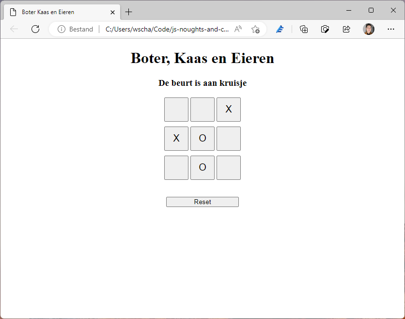

# Boter, Kaas en Eieren met JavaScript



Boter, kaas en eieren is een spel dat vrijwel door ieder kent gespeelt wordt op de basisschool.
Dit populaire spelletje gaan we namaken doormiddel van JavaScript met een klein beetje HTML en CSS.
Hoewel HTML en CSS wel onderdeel zijn van de instructie, zal er meer nadruk leggen op JavaScript.
We gaan een simpele website maken voor ons spel, en die laten we functioneren.
De bestandsstructuur van dit project bevat drie bestanden:

- index.html
- style.css
- app.js

**Let op! Bepaalde voorbeelden gebruiken ... om het voorbeeld compacter te maken.**
**Deze code is ongewijzigd! Niet vervangen!**

## HTML & CSS

Voordat we beginnen met het werken maken van de JavaScript hebben we wat HTML en CSS nodig.
Wil je de code graag bekijken met commentaar? Bekijk ze dan in de code!
We beginnen met de standaard HTML-structuur en de HTML-tags.
Vervolgens geven we doormiddel van de head aan wat de titel is en welke bestanden we gebruiken.

```html
<!DOCTYPE html>

<html>
    <head>
        <title>Boter Kaas en Eieren</title>
        <link rel="stylesheet" href="style.css">
        <script src="app.js"></script>
    </head>
</html>
```

De body-tag komt direct onder de head te staan en bevat de inhoud van de website.
De header wordt gebruikt voor een titel en tekstje voor de status van het spel.
In main laten we het spelbord zien met drie rijen van drie knoppen.
De footer op deze website wordt gebruikt voor de reset knop.

```html
<body>
    <header>
        <h1>Boter, Kaas en Eieren</h1>
        <h3 id="turn-indicator">De beurt is aan kruisje</h3>
    </header>

    <main>
        <div class="row">
            <button id="tl" type="button"></button>
            <button id="tc" type="button"></button>
            <button id="tr" type="button"></button>
        </div>

        <div class="row">
            <button id="ml" type="button"></button>
            <button id="mc" type="button"></button>
            <button id="mr" type="button"></button>
        </div>

        <div class="row">
            <button id="bl" type="button"></button>
            <button id="bc" type="button"></button>
            <button id="br" type="button"></button>
        </div>
    </main>

    <footer>
        <button id="reset" type="button">Reset</button>
    </footer>
</body>
```

De CSS wordt gebruikt om alles wat op de website staat in het midden van de pagina te zetten.
De rijen krijgen boven en onder wat extra adem ruimte en de knoppen worden vierkant.
De reset knop krijgt wat meer afstand tot het veld
en wordt breder gemaakt om beter bij de breedte van het spel te passen.

```css
body {
    margin: auto;
    text-align: center;
}

.row {
    margin: 10px 0;
}

.row button {
    width: 50px;
    height: 50px;
    font-size: 20px;
}

#reset {
    width: 150px;
    margin-top: 25px;
}
```

## De Knoppen

We hebben een website. Laten we direct aan de slag gaan door de knoppen te laten werken.
JavaScript biedt allerlei functies aan genaamd: events.
Met events kun je JavaScript laten reageren op dingen die op de website gebeuren.
Tijdens dit voorbeeld gaan we er twee gebruiken: ```onload``` en ```onclick```.
Het ```onload``` event wordt gebruikt om code uit te voeren nadat de pagina volledig is geladen.
Dit kan belangrijk zijn, je kan knoppen die nog niet op de pagina staat ook niet aanpassen.

```js
// We gebruiken de onload functie om een aantal acties uit te voeren
// als de pagina klaar is met laden
window.onload = function () { };
```

We willen dat alle knoppen in het speelveld wat kunnen doen op het moment dat er op geklikt wordt.
Alle knoppen hebben hiervoor een event nodig, een ```onclick``` event.
De knoppen dienen eerst te worden opgehaald van de webpagina.
Dit kunnen we doen met een ````querySelector``` functie.
Doormiddel van de CSS selector ```.row button``` halen we alle knoppen op die in een rij staan.
Met een forEach functie kunnen we alle knoppen vervolgens iets laten doen.

```js
// We gebruiken de onload functie om een aantal acties uit te voeren
// als de pagina klaar is met laden
window.onload = function () { 
    // We zoeken alle knoppen op die onderdeel zijn van een rij
    // Dit zijn alle knoppen behalve de reset-knop
    const buttons = document.querySelectorAll('.row button');

    // Ga langs alle knoppen
    buttons.forEach(function (button) {
        // Stel de 'onclick' functie in
        button.onclick = move;

        // Zet de innerHTML op &nbsp;
        // Dit is een spatie als HTML code
        // De spatie is nodig voor de stijling
        button.innerHTML = '&nbsp;';
    });
};

// We maken alvast een move functie aan voor later
function move() { }
```

Het eerste dat we met de knoppen doen is een functie aan ```onclick``` koppelen.
In tegenstelling tot hoe ```onload``` is geïmplementeerd, zie je hier alleen een naam.
Dit refereert naar een functie elders in de code, in dit geval de move functie.
Door de code op te splitsen in meerdere functie houden we meer overzicht.
Daarna geven we alle knoppen de tekst ```&nbsp;```, dit is een spatie in HTML-code.
Dit hebben we nodig om alle knoppen inhoud te geven.
Als we dit niet doen vallen de rijen uit elkaar zodra we ze inhoud geven.

De move functie doet nu echter nog niks, we hebben daar wat code nodig.
Om de knoppen een actie te laten doen gaan we de tekst van de knoppen veranderen.
Dit wordt het id van de knop.
Events hebben een aantal standaard parameters waarmee je kan spelen,
de eerste is het event.
Binnen het event krijg je allerlei informatie over wat er gebeurde op de website.
Inclusief op welk onderdeel (voor ons welke knop) het event heeft plaatsgevonden.
Dit noemen we in JavaScript de target van een event.
Ik heb een JSDoc comment toegevoegd voor wat extra informatie over de functie.

```js
/**
 * Een set van de gebruiker, bedoeld als event
 * 
 * @param {PointerEvent} event 
 * Het event om te bepalen op welke knop is geklikt
 */
function move(event) { 
    // Verander de tekst van de knop waarop is geklikt
    event.target.innerHTML = 'X';
}
```

## Beurten

Als er nu op een knop wordt geklikt zal de tekst altijd veranderen naar een X.
Er moet van beurt worden veranderd.
Om hiermee te beginnen definiëren we bovenin het bestand een variabele.
Deze variabele heet ```turnX``` en bevat een booleaanse waarde.
Als deze waarde true is, dan is X aan de beurt; anders O.

```js
// Variabelen voor het bijhouden van het spel
let turnX = true;
```

Om van beurt te wisselen moeten we de ```move``` functie aanpassen.
Gebaseerd op de ```turnX``` variabele gaan we het teken bepalen.
Dit doen we ```ternary``` operator.
Deze wordt gebruikt om op basis van een conditie tussen twee waardes te kiezen.
De syntax hiervoor is: ```conditie ? waar : niet-waar```.
Daarnaa moeten we de beurt wisselen.

```js
/**
 * Een set van de gebruiker, bedoeld als event
 * 
 * @param {PointerEvent} event 
 * Het event om te bepalen op welke knop is geklikt
 */
function move(event) { 
    // Verander de tekst van de knop waarop is geklikt
    event.target.innerHTML = turnX ? 'X' : 'O';

    // Verander de beurt
    turnX = !turnX;
}
```

We kunnen nu vakjes vullen met om en om een kruisje en een rondje.
De vakjes kunnen echter worden overschreven.
Er moeten worden gecontroleerd of het vakjes vrij is voordat we iets doen.
Dit kunnen we doen door te bepalen of de inhoud van een vakje een spatie is.

```js
/**
 * Een set van de gebruiker, bedoeld als event
 * 
 * @param {PointerEvent} event 
 * Het event om te bepalen op welke knop is geklikt
 */
function move(event) { 
    // Controleer of de knop leeg is en het spel nog bezig is
    if (event.target.innerHTML === '&nbsp;') {
        // Verander de tekst van de knop waarop is geklikt
        event.target.innerHTML = turnX ? 'X' : 'O';

        // Verander de beurt
        turnX = !turnX;
    }
}
```

Naast de beurt moet er ook gekeken worden naar het veranderen van de ```turn-indicator```.
We moeten namelijk wel naar de gebruiker communiceren wie er aan de beurt is.
Dit gaan we op dezelfde manier doen als de inhoud van de knop.

```js
/**
 * Een set van de gebruiker, bedoeld als event
 * 
 * @param {PointerEvent} event 
 * Het event om te bepalen op welke knop is geklikt
 */
function move(event) { 
    // Controleer of de knop leeg is en het spel nog bezig is
    if (event.target.innerHTML === '&nbsp;') {
        // Verander de tekst van de knop waarop is geklikt
        event.target.innerHTML = turnX ? 'X' : 'O';

        // Verander de beurt
        turnX = !turnX;

        // Controleer wie er is en geef dit aan
        turnIndicator.innerHTML = turnX
            ? 'De beurt is aan kruisje'
            : 'De beurt is aan rondje';
    }
}
```

## Reset

We kunnen de vakjes voorzien van inhoud, maar wat gebeurd daarna?
Tijd om te gaan werken aan de reset functie.
Op het moment dat we op de reset knop drukken wordt het spel teruggezet naar de beginstand.
De knoppen moeten worden leegemaakt.
Deze functionaliteit hebben we echter al eens geïmplementeerd.
Om dit her te gebruiken, gaan we hier een functie van maken.
Uit de ```onload``` halen we de code die met de knoppen te maken heeft.
De functie plaatsen we ondering het document.

```js
// We gebruiken de onload functie om een aantal acties uit te voeren
// als de pagina klaar is met laden
window.onload = function () {
    // Stel de knoppen in voor het eerste gebruik.
    resetButtons();
};

/**
 * Een set van de gebruiker, bedoeld als event
 * 
 * @param {PointerEvent} event 
 * Het event om te bepalen op welke knop is geklikt
 */
function move(event) {...}

/**
 * Reset de knoppen die onderdeel zijn van het spel
 * De knoppen worden ingesteld voor een spel dat nog moet beginnen
 * Deze functie zet de 'onclick' functie goed en de innerHTML
 */
function resetButtons() {
    // We zoeken alle knoppen op die onderdeel zijn van een rij
    // Dit zijn alle knoppen behalve de reset-knop
    const buttons = document.querySelectorAll('.row button');

    // Ga langs alle knoppen
    buttons.forEach(function (button) {
        // Stel de 'onclick' functie in
        button.onclick = move;

        // Zet de innerHTML op &nbsp;
        // Dit is een spatie als HTML code
        // De spatie is nodig voor de stijling
        button.innerHTML = '&nbsp;';
    });
}
```

De functie die we zojuist hebben geschreven moeten nu aan de reset-knop worden gekoppeld.
Hiervoor kunnen we gebruik maken van het ```onclick``` event van de button.
We gaan een extra functie aanmaken genaamd ```reset``` om deze logica op te slaan.

```js
// We gebruiken de onload functie om een aantal acties uit te voeren
// als de pagina klaar is met laden
window.onload = function () {
    // Stel de knoppen in voor het eerste gebruik.
    resetButtons();
};

/**
 * Een set van de gebruiker, bedoeld als event
 * 
 * @param {PointerEvent} event 
 * Het event om te bepalen op welke knop is geklikt
 */
function move(event) {...}

/**
 * Reset het spel zodat er opnieuw begonnen kan worden
 */
function reset() {
    // Reset de knoppen
    resetButtons();
}

/**
 * Reset de knoppen die onderdeel zijn van het spel
 * De knoppen worden ingesteld voor een spel dat nog moet beginnen
 * Deze functie zet de 'onclick' functie goed en de innerHTML
 */
function resetButtons() {...}
```

## Gelijkspel

```js
// Variabelen voor het bijhouden van het spel
let turnX = true;
let turnCount = 1;
let isFinished = false;
```

Nu de beurt gewisseld kan worden en het spel opnieuw kan worden begonnen,
is het tijd om te gaan kijken naar het beëindigen van het spel.
Laten we beginnen met het controleren of alle vakjes vol zijn.
Dit gaan we doen door twee extra variabelen toe te voegen voor het spel:
```turnCount``` en ```isFinished```. De ```turnCount``` bevat het aantal beurten.
```isFinished``` geeft aan of het spel voorbij is.
Beide variabele implementeren we in de move functie.

```js
/**
 * Een set van de gebruiker, bedoeld als event
 * 
 * @param {PointerEvent} event 
 * Het event om te bepalen op welke knop is geklikt
 */
function move(event) { 
    // Controleer of de knop leeg is en het spel nog bezig is
    if (event.target.innerHTML === '&nbsp;') {
        // Verander de tekst van de knop waarop is geklikt
        event.target.innerHTML = turnX ? 'X' : 'O';

        // Controleer of het bord vol is
        if (turnCount === 9) {
            // Het spel is voorbij
            isFinished = true;

            // Geef het gelijke spel aan
            turnIndicator.innerHTML = "Gelijkspel"
        }

        // Het spel is nog niet voorbij dus we gaan verder
        else {
            // Verander de beurt
            turnX = !turnX;

            // Tell de beurt op
            turnCount = turnCount + 1;
    
            // Controleer wie er is en geef dit aan
            turnIndicator.innerHTML = turnX
                ? 'De beurt is aan kruisje'
                : 'De beurt is aan rondje';
        }
    }
}
```

We kunnen het spel spelen en merken dat bij een vol bord,
dit wordt aangegeven in de ```turnIndicator```.
Op het moment dat er op reset wordt geklikt, blijft deze echter ongewijzigd.
Dit kunnen we aanpassen door het stukje code dat de beurt aangeeft,
te verplaatsen naar een functie en te hergebruiken in ```reset```.

```js
// We gebruiken de onload functie om een aantal acties uit te voeren
// als de pagina klaar is met laden
window.onload = function () {...};

/**
 * Een set van de gebruiker, bedoeld als event
 * 
 * @param {PointerEvent} event 
 * Het event om te bepalen op welke knop is geklikt
 */
function move(event) { 
    // Controleer of de knop leeg is en het spel nog bezig is
    if (event.target.innerHTML === '&nbsp;') {
        // Verander de tekst van de knop waarop is geklikt
        event.target.innerHTML = turnX ? 'X' : 'O';

        // Controleer of het bord vol is
        if (turnCount === 9) {
            // Het spel is voorbij
            isFinished = true;

            // Geef het gelijke spel aan
            turnIndicator.innerHTML = "Gelijkspel"
        }

        // Het spel is nog niet voorbij dus we gaan verder
        else {
            // Verander de beurt
            turnX = !turnX;

            // Tell de beurt op
            turnCount = turnCount + 1;
    
            // Controleer wie er is en geef dit aan
            updateIndicator();
        }
    }
}

/**
 * Reset het spel zodat er opnieuw begonnen kan worden
 */
function reset() {
    // Reset de knoppen en laat zien wie er aan de beurt is
    resetButtons();
    updateIndicator();
}

/**
 * Reset de knoppen die onderdeel zijn van het spel
 * De knoppen worden ingesteld voor een spel dat nog moet beginnen
 * Deze functie zet de 'onclick' functie goed en de innerHTML
 */
function resetButtons() {...}

/**
 * Laat zien wie er aan de beurt is in de turn indicator
 */
function updateIndicator() {
    // Controleer wie er is en geef dit aan
    turnIndicator.innerHTML = turnX
        ? 'De beurt is aan kruisje'
        : 'De beurt is aan rondje';
}
```

## De Overwinning

Er blijft nu nog een enkel scenario over: de overwinning.
Op het moment dat iemand het spel heeft gewonnen dient dit ook kenbaar te worden gemaakt.
Dit probleem kan op verschillende manieren worden aangepakt.
De eerste manier is via een reeks aan if en if-else statements.
Dit heeft echter niet de voorkeur omdat de code snel onoverzichtelijk maakt.
Voor het bepalen van de overwinning gebruiken we in dit voorbeeld een driedimensionale reeks.
Deze bevat alle mogelijke vakjes die samen drie dezelfde tekens kunnen hebben op een rij.
Deze reeks wordt bovenin het document geplaats, onder de spel variabelen.

```js
// Variabelen voor het bijhouden van het spel
let turnX = true;
let turnCount = 1;
let isFinished = false;

// Een constante die de mogelijke winreeksen bevat
// We gebruiken een drie-dimensionale reeks om een reeks ifjes te voorkomen
const winConditions = [
    ['tl', 'tc', 'tr'], ['ml', 'mc', 'mr'], ['bl', 'bc', 'br'],
    ['tl', 'ml', 'bl'], ['tc', 'mc', 'bc'], ['tr', 'mr', 'br'],
    ['tl', 'mc', 'br'], ['tr', 'mc', 'bl']
];
```

Vervolgens gaan we een functie maken die controleert of iemand heeft gewonnen.
We doen dit in een aparte functie omdat de code relatief vrij lang is.
Dit zorgt ervoor dat we overzicht behouden binnen de code.
Deze functie zetten we onderin het document.

Voor iedere mogelijke combinatie aan vakjes halen we de inhoud van de vakjes op.
Vervolgens kijken we of geen van de vakjes niet leeg zijn,
anders zegt het programma direct dat er gewonnen is omdat er drie vakjes op rij leeg zijn.
Daarna controleren we of de inhoud van de vakjes hetzelfde is.

```js
/**
 * Controleer of iemand heeft gewonnen
 */
function checkWinCondition() {
    // Maak een variabel aan om het resultaat op te slaan
    // Standaard is deze waarde vals, hij veranderd als iemand 
    let result = false;

    // Controleer voor iedere mogelijke combinatie of er is gewonnen
    winConditions.forEach(function (condition) {
        // Haal de inhoud van de knoppen uit de reeks op
        const firstButton = document.getElementById(condition[0]).innerHTML;
        const secondButton = document.getElementById(condition[1]).innerHTML;
        const thirdButton = document.getElementById(condition[2]).innerHTML;
        
        // Controleer of de knoppen niet leeg zijn
        if (firstButton != '&nbsp;' && secondButton != '&nbsp;' && thirdButton != '&nbsp;') {
            // Controleer of er is gewonnen
            if (firstButton === secondButton && secondButton === thirdButton) {
                // Er is gewonnen
                result = true;
            }
        }
    });
    
    // Niemand heeft gewonnen
    return result;
}
```

Deze functie moeten we toevoegen aan de ```move``` functie en dan is ons programma af.
We hebben nu vanaf niks een werkend spelletje boter kaas en eieren gemaakt voor twee spelers.
Deze versie kan zo vaak gespeeld worden als mensen willen.
Probeer voor jezelf nu eens aanpassingen te maken aan het project,
zijd het in de JavaScript of de zaaie interface die we tijdens dit voorbeeld hebben gemaakt.
De complete JavaScript code zie je hier beneden.

```js
// Variabelen voor het bijhouden van het spel
let turnX = true;
let turnCount = 1;
let isFinished = false;

// Een constante die de mogelijke winreeksen bevat
// We gebruiken een drie-dimensionale reeks om een reeks ifjes te voorkomen
const winConditions = [
    ['tl', 'tc', 'tr'], ['ml', 'mc', 'mr'], ['bl', 'bc', 'br'],
    ['tl', 'ml', 'bl'], ['tc', 'mc', 'bc'], ['tr', 'mr', 'br'],
    ['tl', 'mc', 'br'], ['tr', 'mc', 'bl']
];

// Maak een variabele aan voor de turnindicator
// We zetten deze in een variabele omdat hij vaak wordt gebruikt
// Deze geven we nog geen waarde, 
// omdat we niet zeker weten of de pagina al klaar is met laden
let turnIndicator = null;

// We gebruiken de onload functie om een aantal acties uit te voeren
// als de pagina klaar is met laden
window.onload = function () {
    // Stel de knoppen in voor het eerste gebruik.
    resetButtons();

    // Geef de reset knop de juiste functie
    document.getElementById('reset').onclick = reset;

    // Stel de turn indicator in.
    turnIndicator = document.getElementById('turn-indicator');
};

/**
 * Een set van de gebruiker, bedoeld als event
 * 
 * @param {PointerEvent} event 
 * Het event om te bepalen op welke knop is geklikt
 */
function move(event) {
    // Controleer of de knop leeg is en het spel nog bezig is
    if (event.target.innerHTML === '&nbsp;' && !isFinished) {
        // Verander de inhoud van de knop
        event.target.innerHTML = turnX ? 'X' : 'O';
        
        // Controleer de overwinnigsconditie
        if (checkWinCondition()) {
            // Het spel is voorbij
            isFinished = true;

            // Gebruik de turnidicator voor het resultaat
            turnIndicator.innerHTML = turnX
                ? 'Keuisje wint!'
                : 'Rondje wint!'
        }
        
        // Controleer of het bord vol is
        else if (turnCount === 9) {
            // Het spel is voorbij
            isFinished = true;

            // Geef het gelijke spel aan
            turnIndicator.innerHTML = "Gelijkspel"
        }
        
        // Het spel is nog niet voorbij dus we gaan verder
        else {
            // Verander de speler
            turnX = !turnX;

            // Tell de beurt op
            turnCount = turnCount + 1;

            // Toon wie er aan de beurt is
            updateIndicator();
        }
    }
}

/**
 * Reset het spel zodat er opnieuw begonnen kan worden
 */
function reset() {
    // Reset de variabele naar hun originele waarde
    isFinished = false;
    turnCount = 1;

    // Reset de knoppen en laat zien wie er aan de beurt is
    resetButtons();
    updateIndicator();
}

/**
 * Reset de knoppen die onderdeel zijn van het spel
 * De knoppen worden ingesteld voor een spel dat nog moet beginnen
 * Deze functie zet de 'onclick' functie goed en de innerHTML
 */
function resetButtons() {
    // We zoeken alle knoppen op die onderdeel zijn van een rij
    // Dit zijn alle knoppen behalve de reset-knop
    const buttons = document.querySelectorAll('.row button');

    // Ga langs alle knoppen
    buttons.forEach(function (button) {
        // Stel de 'onclick' functie in
        button.onclick = move;

        // Zet de innerHTML op &nbsp;
        // Dit is een spatie als HTML code
        // De spatie is nodig voor de stijling
        button.innerHTML = '&nbsp;';
    });
}

/**
 * Laat zien wie er aan de beurt is in de turn indicator
 */
function updateIndicator() {
    // Controleer wie er is en geef dit aan
    turnIndicator.innerHTML = turnX
        ? 'De beurt is aan kruisje'
        : 'De beurt is aan rondje';
}

/**
 * Controleer of iemand heeft gewonnen
 */
function checkWinCondition() {
    // Maak een variabel aan om het resultaat op te slaan
    // Standaard is deze waarde vals, hij veranderd als iemand 
    let result = false;

    // Controleer voor iedere mogelijke combinatie of er is gewonnen
    winConditions.forEach(function (condition) {
        // Haal de inhoud van de knoppen uit de reeks op
        const firstButton = document.getElementById(condition[0]).innerHTML;
        const secondButton = document.getElementById(condition[1]).innerHTML;
        const thirdButton = document.getElementById(condition[2]).innerHTML;
        
        // Controleer of de knoppen niet leeg zijn
        if (firstButton != '&nbsp;' && secondButton != '&nbsp;' && thirdButton != '&nbsp;') {
            // Controleer of er is gewonnen
            if (firstButton === secondButton && secondButton === thirdButton) {
                // Er is gewonnen
                result = true;
            }
        }
    });
    
    // Niemand heeft gewonnen
    return result;
}
```